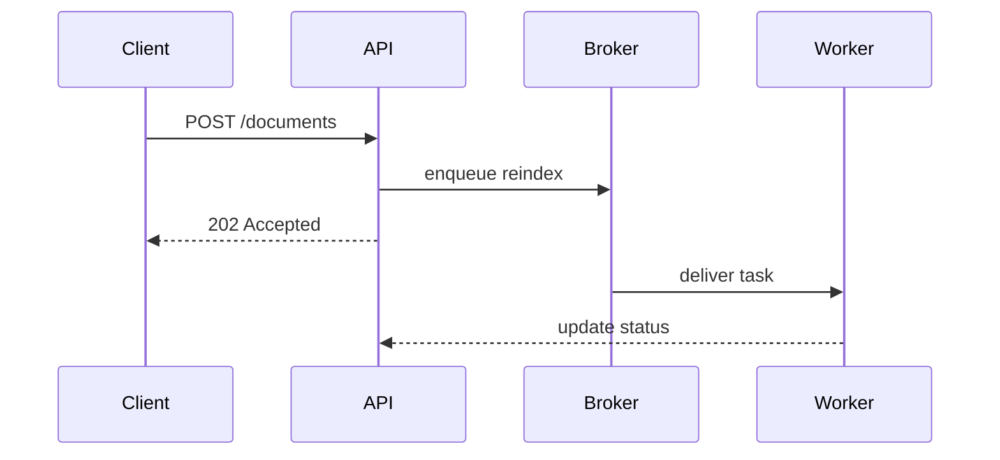

Help the user understand the current topic of conversation visually. Skip the preamble and keep prose brief. Pick the smallest view that makes the key point clear.

- Show logic or an algorithm as pseudocode:

```text
on(ingest)
  if digest is unchanged
    return stored document
  write new revision
  enqueue reindex
  return fresh document
```

- Show runtime control flow as a call tree:

```text
ingest_document
  validate_payload
  store_revision
    compute_digest
    write_blob
  enqueue_reindex
```

- Show composed or nested structure as an indented tree, including the state and boundaries that matter — a router/middleware stack, a pipeline, a class hierarchy, a UI component tree:

```text
FastAPI app (src/myproj/api/app.py)
  AuthMiddleware          # resolves require_user
  RequestIdMiddleware
  router: /documents      (api/routes/documents.py)
    POST /  -> ingest_document
      depends: require_user, get_session
    GET  /{id} -> read_document
```

  The same shape works for a UI:

```tsx
<DocumentPage> (web/src/routes/document.tsx)
  useDocumentEvents()
  <DocumentToolbar>
    <ReindexButton> (packages/ui)
```

- Show file responsibility or a broad refactor as a shallow file tree:

```text
src/myproj/
├── api/            # HTTP surface, validation
├── worker/         # background tasks
├── db/             # models and repositories
└── clients/        # outbound HTTP
```

- Show component interaction, control flow, or data flow with Mermaid:



- Use `diff` when the point is what changes and the surrounding shape already exists. Match the diff shape to the topic.

For a structural change:

```diff
 FastAPI app
   AuthMiddleware
+  RateLimitMiddleware
   router: /documents
     POST /  -> ingest_document
+    DELETE /{id} -> delete_document
```

For a file-layout change:

```diff
 src/myproj/
 ├── api/
+│   └── errors.py        # RFC 7807 handler
 ├── db/
-└── clients.py
+└── clients/
+    ├── base.py
+    └── search.py
```

For a call-tree or call-stack change:

```diff
 ingest_document
   validate_payload
   store_revision
+    compute_digest
     write_blob
-  enqueue_reindex
+  enqueue_reindex
+    dedupe_pending
```

For a state or control-flow change:

```diff
 on(ingest)
-  write revision
+  if digest is unchanged
+    return stored document
+  write new revision
+  invalidate cache
```

- Show the whole block when most of it is new, when omitted context would hide ownership or order, or when the user needs a copyable target shape:

```python
def compute_digest(payload: bytes) -> str:
    """Stable content hash — the ingest path dedupes on this."""
    return hashlib.blake2b(payload, digest_size=16).hexdigest()
```

- For a visual UI, layout, state comparison, or concept too dense for Mermaid, produce one focused visual — a diagram, an infographic, or a short slide deck, whichever fits the point. Match the product's colors, type, spacing, and components; use real labels and data; support desktop and mobile.

  Where the harness can render or publish HTML for the user (an artifact, canvas, or preview pane), use that. Otherwise write a single self-contained HTML file (`show-me-{description}.html`, in a scratch or temp directory, not the repo) and open it with the platform opener:

```bash
open show-me-{description}.html        # macOS
xdg-open show-me-{description}.html    # Linux
start show-me-{description}.html       # Windows
```

  If you cannot open a browser, print the absolute path and let the user open it.

### guidance

Match the visual to the surface. Mermaid only helps where the output renders it — in a plain terminal or a diff, prefer the plain-text trees and pseudocode above.

Use the names that are actually in the user's code. A sketch with invented symbols costs them a search to reconcile and teaches them nothing about their own repo.

Place each visual next to the short text it supports. Keep only the calls, files, arguments, states, and boundaries needed to answer the user's current question or the options to resolve the current discussion point.

You may use one of these, you may use several, it is unlikely you will use all of them. Use your judgement and don't overwhelm the user.
